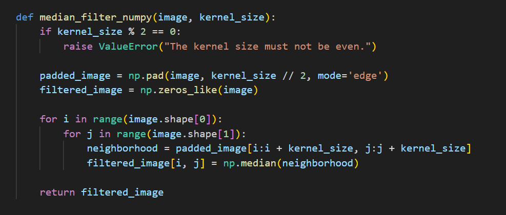
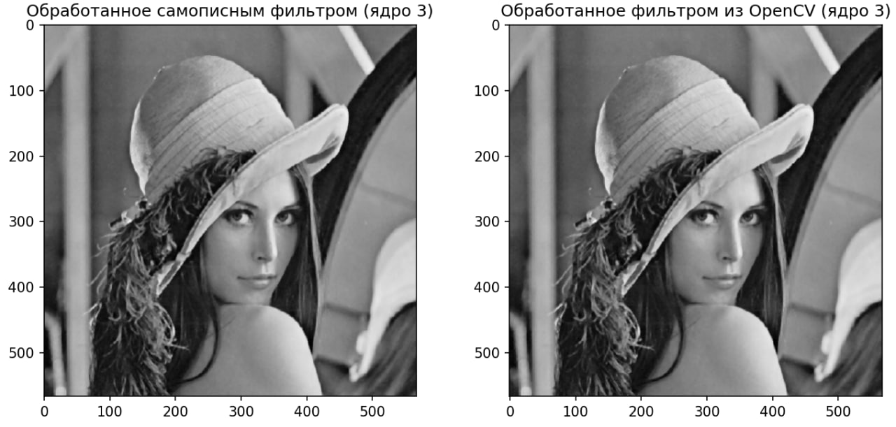
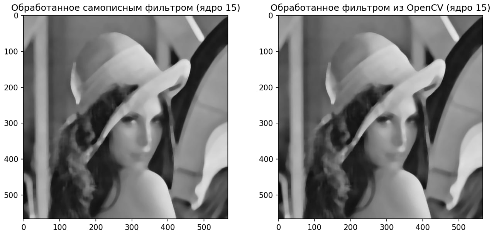
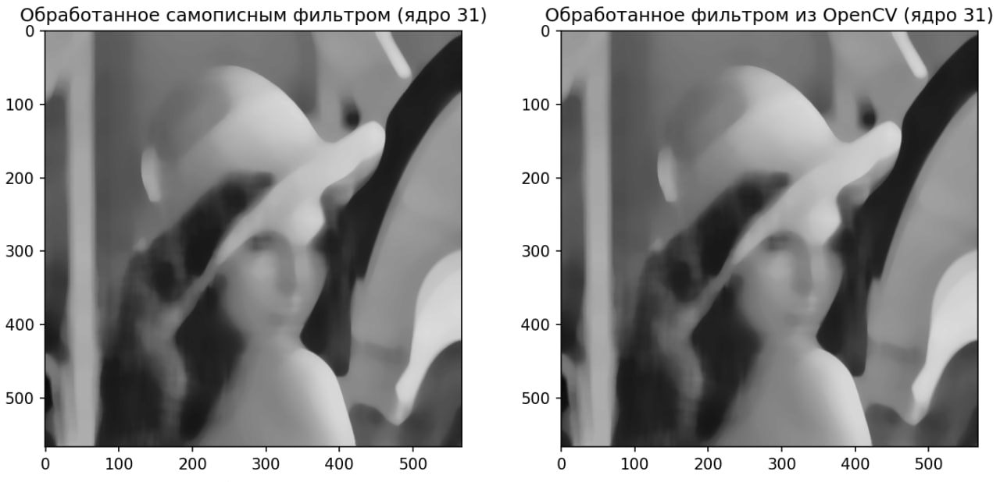
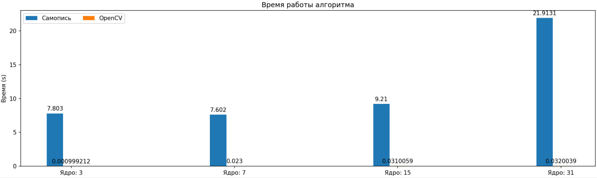

## Теоретическая база
***
Медианный фильтр — это нелинейный фильтр, применяющийся для удаления шумов типа "соль и перец" в изображениях. Он работает по принципу замены значения пикселя медианой значений пикселей в его окрестности, определяемой размером ядра: 
1) Для каждого пикселя выбирается область (ядро), которая определяет, какие пиксели будут использоваться для вычисления медианы. Эта область обычно имеет квадратную форму. Как правило используются ядра нечетной формы, поскольку так однозначно определяется центр ядра
2) Внутри выбранной области значения яркости (или цвета) всех пикселей сортируются (без замены исходных значений).
3) Определяется медианное значение, которое затем заменяет исходной значение центрального пикселя ядра.
4) Пункты 1-4 выполняются для всех пикселей изображения

## Описание программы
***
Программа включает две реализации алгоритма медианного фильтра: нативную  с использованием библиотеки NumPy, а также метод medianBlur библиотеки OpenCV. 
#### Нативная реализация

1) Проверяется нечётность размера ядра
2) Изображение дополняется границами для обработки краевых пикселей
3) Для каждого пикселя создается окно заданного размера, в котором вычисляется медиана
4) Исходное значение пикселя заменяется медианой

## Результаты работы
***
Результаты обработки изображений представлены ниже:

Время работы программы:

## Выводы по работе
***
В ходе лабораторной работы был реализован медианный фильтр с переменным размером ядра. Наблюдения показали, что выбор размера ядра влияет как на качество обработки изображения, так и на время выполнения алгоритма: с увеличением размера шум удаляется качественнее, но при этом возникает чрезмерное размытие изображения. Вместе с тем растет и время работы программы, т.к. с увеличение размера ядра увеличивается и число пикселей в окрестности, для которых рассчитывается медианное значение.

## Использованные источники
***
1) Документация OpenCV: https://docs.opencv.org/
2) Документация NumPy: https://numpy.org/doc/stable/
